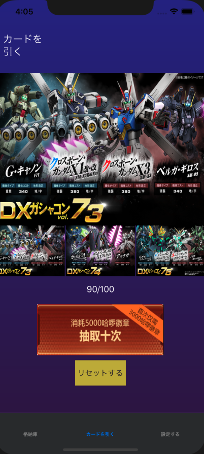
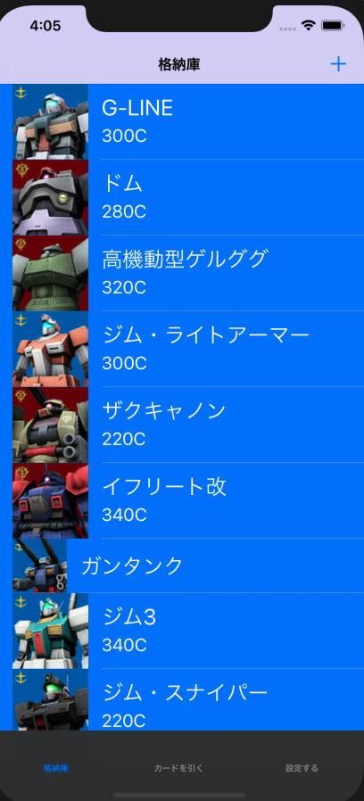
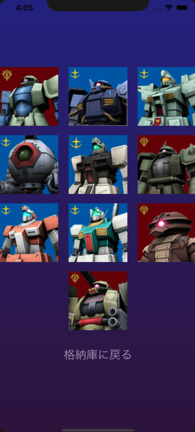

# GundamGame
Support Chinese and Japanese.

The game only supports portrait mode because most JRPG on mobile does that.

1 Root VC is a tab VC with first tab takes you to Garage(Table View):
											If you choose choose EF side, cell background is blur 										and Zeon is red.(saved in default). The + button gives you a two
										options of sorting your gundams based on their cost.
2 Second tab is draw gundam.
											You have 3 pools available, Each has 100 draws. The big 
										red button will draw 10 of the current pool. you can click on small
										images to change pool or swipe on big image.(4 gesture 										recognizer). Yellow button resets current pool. If you get r										epeated gundams the repeated ones will not show in garage 										because you ve already own them. You can delete gundam it 										garage if you want. After draw, you can click on the last line 										button and return to garage to see your new collections!

3 Third tab holds all settings(user defaults)
											You can change volume of BGM or turn it off. Segment 										controls memorizes the side you pick and will change cell 										background. The last line is a button that takes you to “official 										website”

View DEMO to see what this game looks like.

